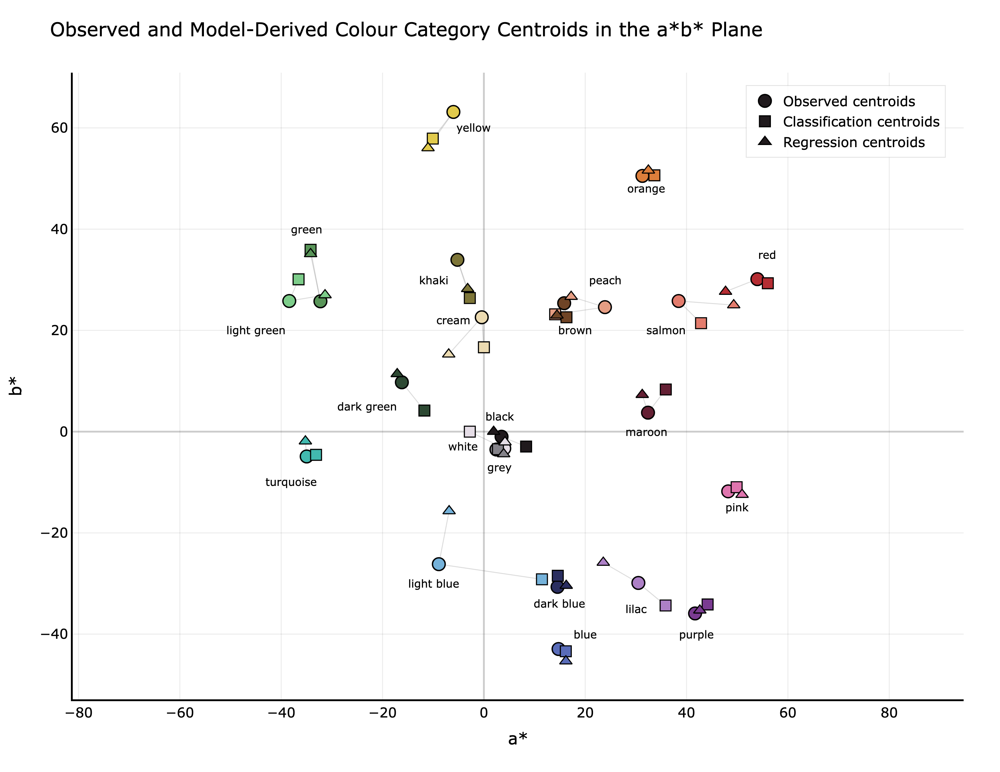
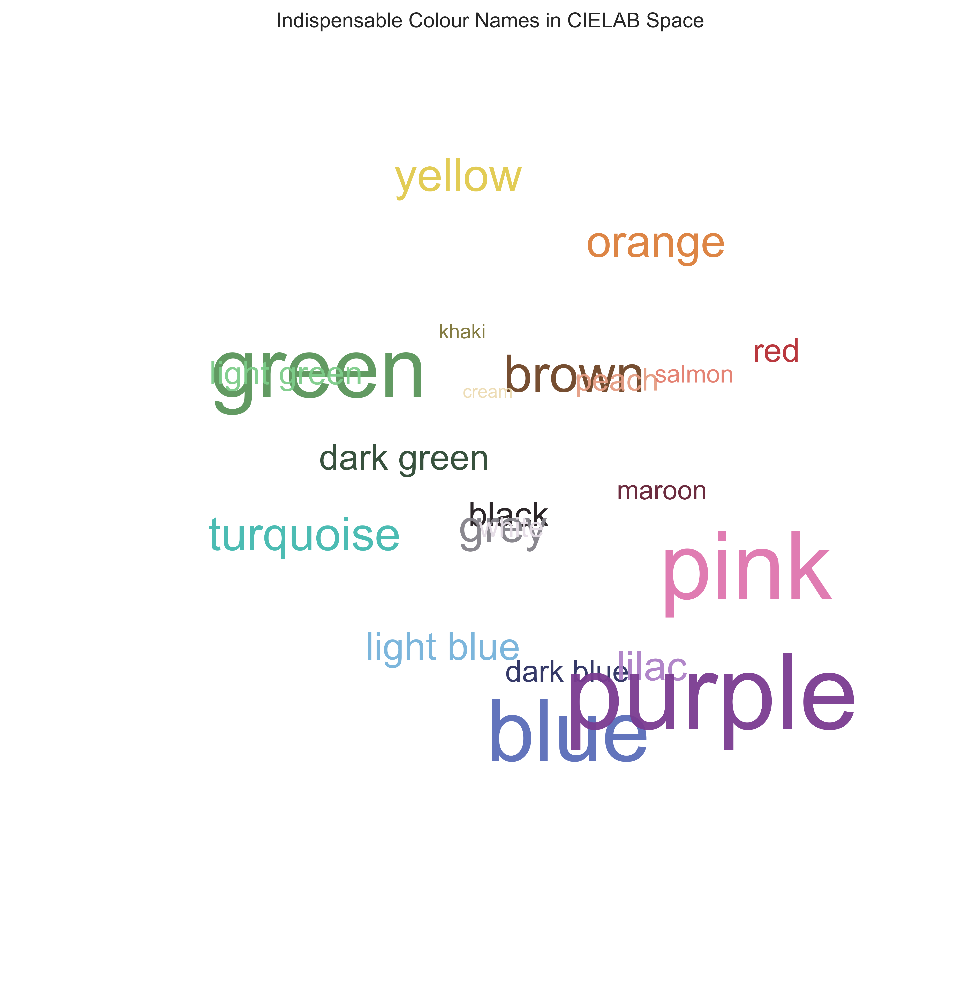

# Perceptual Colour Naming in CIELAB Space

## Overview
This project builds a perceptually grounded machine learning pipeline for mapping continuous colour values in CIELAB space to human colour names.

## Problem
Colour perception is continuous, but language is discrete. This creates ambiguity when assigning colour labels such as “blue”, “green”, or “gold”.

## Approach
- Convert RGB → CIELAB
- Extract features: L*, a*, b*, chroma, hue
- Reduce 1,113 labels → 22 indispensable categories
- Compare:
  - Classification (Random Forest, Extra Trees)
  - Regression (distribution prediction)
- Evaluate using:
  - Accuracy, Macro-F1
  - Hellinger distance
  - ΔE00 (perceptual error)

## Key Results
- Accuracy: 0.713 (Random Forest)
- Macro-F1: 0.598
- Best Hellinger: 0.448
- Jewellery top-1: 42.1%
- Top-3 (regression): 78.9%
- Regression closer to observed centroids in 17/22 categories

## Visualisations

## Report
[Read full dissertation](report/Dissertation.pdf)

## Future Work
- Add interactive demo (Streamlit)
- Improve spatial image understanding
- Expand dataset